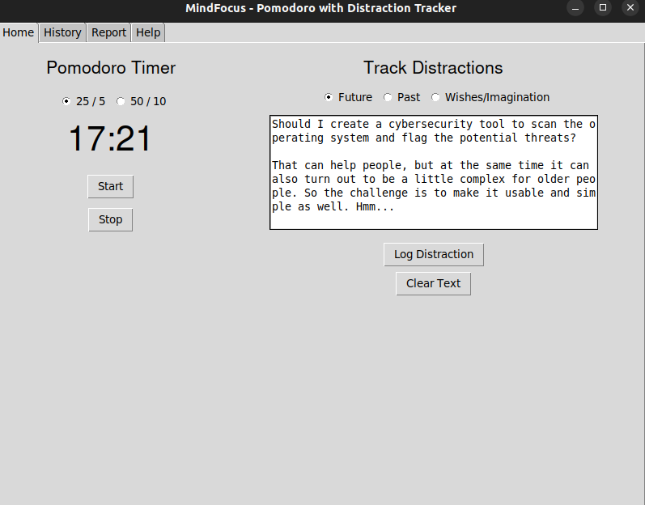
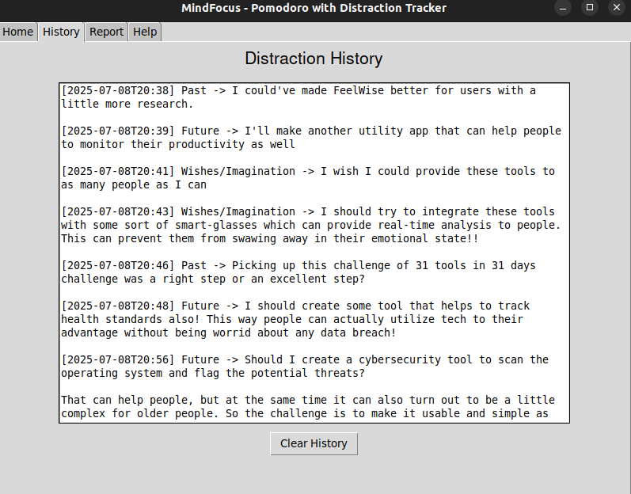
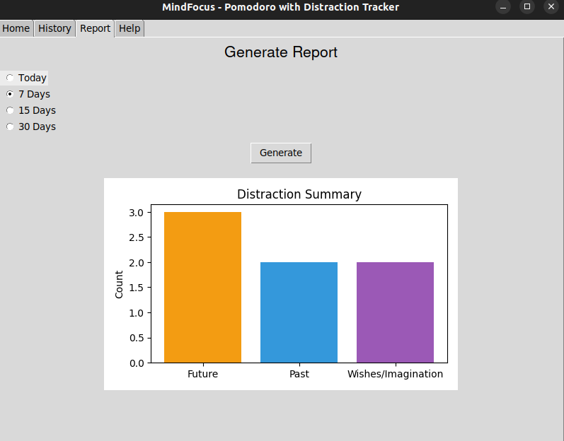

# 🧠 WorkWise - Pomodoro + Distraction Tracker

WorkWise is your personalized Pomodoro timer with a built-in distraction tracker to boost your focus and emotional intelligence over time.

## ✨ Features

- ⏲️ **Pomodoro Timer** – Start focused work sessions (25/5, 50/10).
- 💭 **Distraction Logger** – Log your distractions during sessions.
  - Categorize thoughts as:
    - Future
    - Past
    - Imagination/Wishes
- 📈 **Distraction Analytics** – Visual reports for:
  - Today
  - Last 7 Days
  - Last 15 Days
  - Last 30 Days
- 🗃️ **Distraction History** – View and manage all past logs.
- 📝 **Session Notes** – Capture insights and reflections.
- 📖 **Instructions Tab** – Built-in help and guide.
- 🧹 **Clear Data Options** – Delete notes or entire history.
- 🎯 **No AI/Cloud Dependency** – Works offline, your data stays private.

### Screenshots:

> 


> 


> 


> 


---

## 🖥️ Installation Instructions

### 1. 🔧 Install dependencies

Run this inside your project directory:

```bash
pip install -r requirements.txt
```


### Create the installer for your system.

🪟 Windows (create .exe)
```bash
pip install pyinstaller
pyinstaller --noconfirm --onefile --windowed main.py

```

🍎 macOS (create .app or .dmg)
1. On MacOS System

```bash
pip install pyinstaller
pyinstaller --noconfirm --windowed --onefile main.py --icon=icon.icns
```
2. To make a .dmg install
```bash
brew install create-dmg
create-dmg 'dist/main.app'
```

🐧 Linux (create .AppImage)
```bash
pip install pyinstaller
pyinstaller --onefile --windowed main.py
```

### 📦 OR Download Executable (Recommended)

Download the installer for your OS:

| Platform | Installer Link |
|---------|----------------|
| 🪟 Windows | `WorkWise.exe` |
| 🍎 macOS | `WorkWise.dmg` |
| 🐧 Linux | `WorkWise.AppImage` |

> No Python needed with these – just install and launch!
